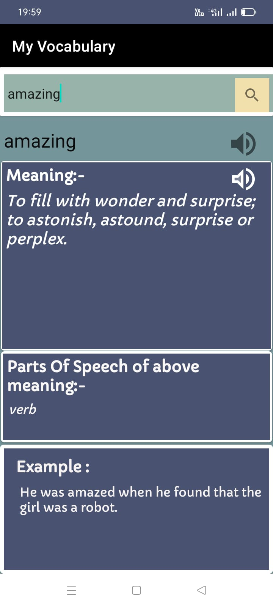
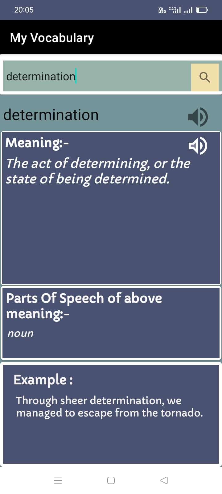

#           <h1 align="center"> Dictionary At Your Fingertips</h1>

This app does API calling from dictionary API. Also, I have used retrofit  
library, GSON, and data binding features. I have also played audio, phonetics of 
words given in API using MediaPlayer(). It has TextToSpeech accessibility  
feature to speak out the meaning of a word. 

<table align="center">
    <thead>
        <tr>
          <th colspan="2"><b>Screenshots</b></th>
        </tr>
    </thead>
    <tbody >
        <tr>
            <td></td>
            <td></td>
        </tr>
    </tbody>
</table>

